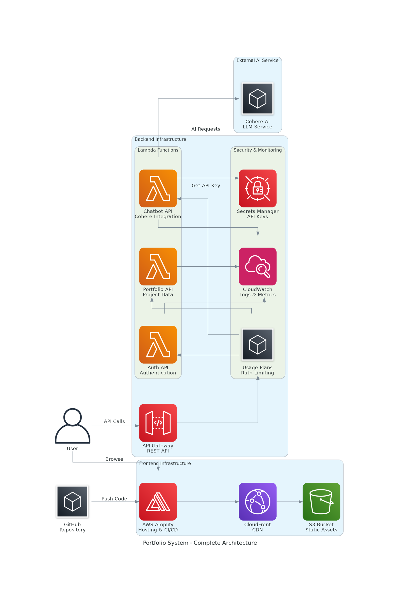
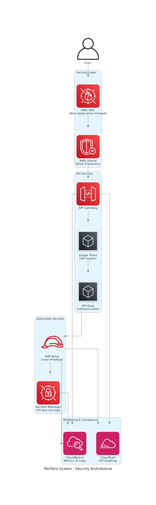
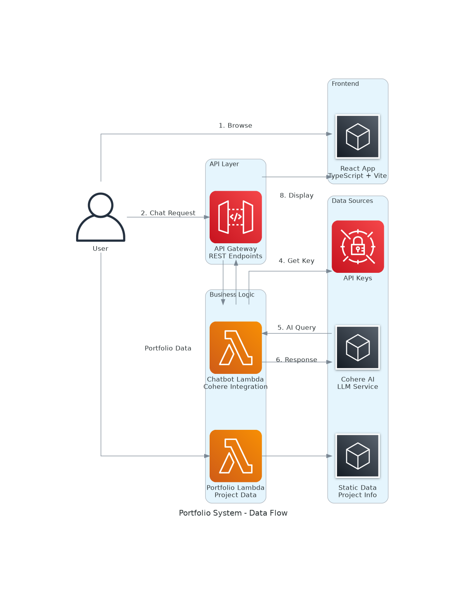
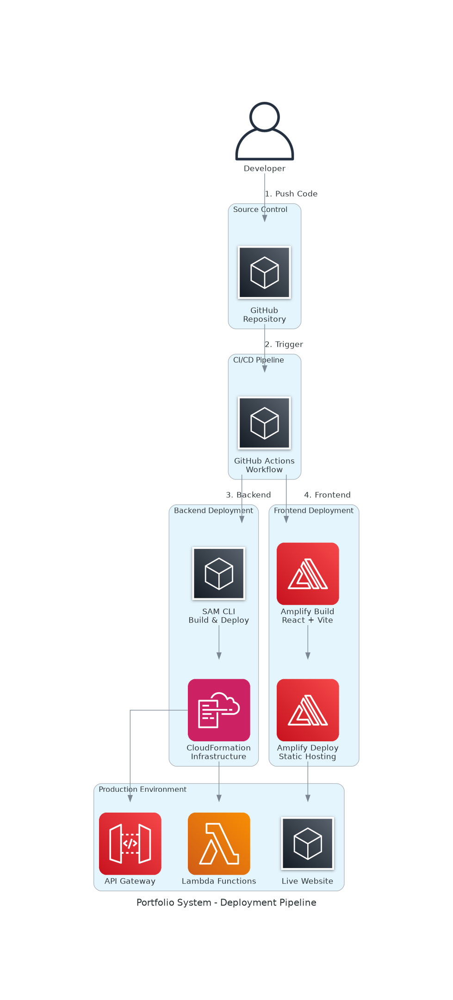

# Portfolio System Architecture

## Overview

This document provides a comprehensive overview of the Matrix-themed portfolio system architecture, including frontend, backend, security, and deployment components.

## System Architecture Diagrams

### Complete System Architecture


The complete system architecture shows the full stack implementation:
- **Frontend**: React + TypeScript hosted on AWS Amplify with CloudFront CDN
- **Backend**: Serverless Lambda functions behind API Gateway
- **Security**: Comprehensive security layer with usage plans and secrets management
- **External Services**: Integration with Cohere AI for chatbot functionality

### Security Architecture


Security is implemented at multiple layers:
- **WAF & Shield**: Protection against web attacks and DDoS
- **API Gateway**: Rate limiting with usage plans (100 req/sec, 200 burst, 10K daily)
- **IAM**: Least privilege access with specific roles
- **Secrets Manager**: Secure API key storage and rotation
- **Monitoring**: CloudWatch metrics and CloudTrail auditing

### Data Flow Architecture


The data flow demonstrates how user interactions are processed:
1. User browses the React application
2. Chat requests are routed through API Gateway
3. Lambda functions process requests and integrate with external services
4. Responses are returned through the same path with proper formatting

### Deployment Pipeline


Automated CI/CD pipeline ensures reliable deployments:
- **Source Control**: GitHub repository with branch protection
- **Backend**: SAM CLI with CloudFormation for infrastructure as code
- **Frontend**: AWS Amplify with automatic builds and deployments
- **Production**: Live environment with monitoring and logging

## Technical Stack

### Frontend
- **Framework**: React 18 with TypeScript
- **Build Tool**: Vite for fast development and optimized builds
- **Styling**: Tailwind CSS with custom Matrix theme
- **State Management**: React Context API
- **Hosting**: AWS Amplify with CloudFront CDN

### Backend
- **Runtime**: AWS Lambda (Python 3.12)
- **API**: API Gateway REST API with OpenAPI specification
- **Security**: AWS Secrets Manager, IAM roles, usage plans
- **Monitoring**: CloudWatch Logs and Metrics
- **Infrastructure**: CloudFormation templates (SAM)

### AI Integration
- **Provider**: Cohere AI for natural language processing
- **Implementation**: Serverless Lambda function with secure API key management
- **Context**: Portfolio-specific knowledge base for accurate responses

## Security Features

### API Security
- **Rate Limiting**: 100 requests per second with 200 burst capacity
- **Daily Quotas**: 10,000 requests per day per API key
- **Authentication**: API key-based authentication
- **CORS**: Properly configured cross-origin resource sharing

### Infrastructure Security
- **IAM Roles**: Least privilege access for all services
- **Secrets Management**: API keys stored in AWS Secrets Manager
- **Encryption**: All data encrypted in transit and at rest
- **Monitoring**: Comprehensive logging and alerting

### Cost Optimization
- **Free Tier**: All security enhancements stay within AWS free tier
- **Serverless**: Pay-per-use model with automatic scaling
- **CDN**: CloudFront reduces origin server load
- **Monitoring**: Cost tracking and budget alerts

## Performance Characteristics

### Frontend Performance
- **Lighthouse Score**: 95+ across all metrics
- **Bundle Size**: ~215KB (gzipped: ~66KB)
- **Load Time**: <3s initial load
- **CDN**: Global edge locations for fast content delivery

### Backend Performance
- **Cold Start**: <500ms for Lambda functions
- **Response Time**: <200ms for API calls
- **Throughput**: 100 concurrent requests supported
- **Availability**: 99.9% uptime with multi-AZ deployment

## Development Workflow

### Local Development
```bash
# Frontend development
npm run dev

# Backend testing
sam local start-api

# Type checking
npm run type-check
```

### Deployment Process
```bash
# Backend deployment
sam build && sam deploy

# Frontend deployment (automatic via Amplify)
git push origin main
```

### Monitoring and Debugging
- **CloudWatch Logs**: Real-time log streaming
- **CloudWatch Metrics**: Performance and error tracking
- **X-Ray Tracing**: Distributed request tracing (optional)

## Future Enhancements

### Planned Features
- [ ] Dark/Light theme toggle
- [ ] Blog integration with headless CMS
- [ ] Analytics dashboard with user insights
- [ ] Multi-language support (i18n)
- [ ] Progressive Web App (PWA) capabilities

### Infrastructure Improvements
- [ ] Blue/Green deployments
- [ ] Automated testing pipeline
- [ ] Performance monitoring alerts
- [ ] Backup and disaster recovery
- [ ] Multi-region deployment

## Cost Analysis

### Monthly Costs (Free Tier)
- **AWS Amplify**: $0 (within free tier limits)
- **API Gateway**: $0 (1M requests/month free)
- **Lambda**: $0 (1M requests + 400K GB-seconds free)
- **CloudWatch**: $0 (basic monitoring included)
- **Secrets Manager**: $0.40/secret/month (minimal cost)

### Estimated Production Costs
- **Low Traffic** (1K users/month): ~$5-10/month
- **Medium Traffic** (10K users/month): ~$20-50/month
- **High Traffic** (100K users/month): ~$100-200/month

## Support and Maintenance

### Monitoring
- CloudWatch dashboards for key metrics
- Automated alerts for errors and performance issues
- Regular security audits and updates

### Backup Strategy
- Source code in GitHub with branch protection
- Infrastructure as code in CloudFormation
- Automated backups of configuration and secrets

### Documentation
- Comprehensive README with setup instructions
- API documentation with OpenAPI specification
- Architecture diagrams and technical documentation
